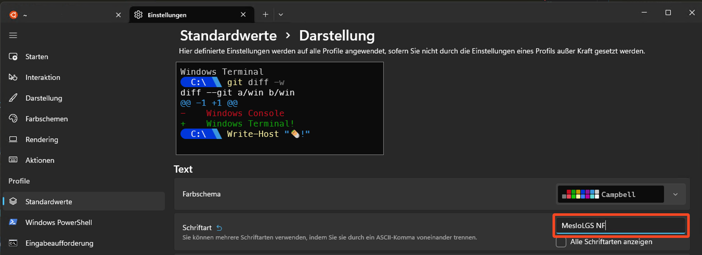

# Setup

Das lokale Setup für Deinen Entwicklungsrechner beginnt mit dem Schritt nach Linux:

- unter Windows installieren wir WSL2 und das Windows Terminal von Microsoft, in WSL2 wählen wir die Ubuntu Distro und installieren `sudo apt install zsh`.
- unter MacOS finden wir bereits eine linux-kompatible Shell mit der `zsh` und ein gutes Terminal-Programm, ergänzen das aber mit `iterm` von [https://iterm2.com/].

## iterm (nur für MacOS)

Am besten installiert man mit `brew`, dem Paketmanager für MacOS.

1. `Terminal.app` öffnen mittels Tastenfolge `CMD+SPACE` `terminal` `ENTER`
2. Darin ausführen:

````bash
/bin/bash -c "$(curl -fsSL https://raw.githubusercontent.com/Homebrew/install/HEAD/install.sh)"
# und danach:
brew install --cask iterm2
````

## Oh-my-zsh

Das `Oh-my-zsh` Projekt erweitert die zsh mit einem Paketmanagement und schönen Voreinstellungen für Prompt und Zeilenvervollständingung.

## Powerlevel10k

Ein besonders beliebtes Theme für die z-Shell ist `powerlevel10k`. Dies läßt sich so installieren:

- MacOS:

  - `brew install powerlevel10k`

- Windows:

  - ````bash
    # wird direkt in den ZSH custom-Ordner ge-clone-t
    git clone --depth=1 https://github.com/romkatv/powerlevel10k.git ${ZSH_CUSTOM:-$HOME/.oh-my-zsh/custom}/themes/powerlevel10k
    ````

Aktiviere das Theme durch Ändern in der .zshrc:

````bash
# ersetzt eingestelltes Theme durch das neue, direkt in der .zshrc Datei des Benutzers
sed -i 's;^ZSH_THEME=".*"$;ZSH_THEME="powerlevel10k/powerlevel10k";' ~/.zshrc
````

### Powerlevel10k Fonts im Windows Terminal

Ändere den Font in den Einstellungen (`CTRL`+`,`), dort unter `Standardwerte` und weiter unter `Schriftart`:



### Powerlevel10k Fonts in VS Code

Bleibt nur noch das theme mit dem besonderen Prompt auch in VS Code korrekt darzustellen. In VS Code muss noch der richtige Font explizit konfiguriert werden:

1. öffne dazu die `user settings (json)`, indem du in der command palette (`F1` oder `CTRL`+`P`) danach suchst,
1. ändere diese Eigenschaft:

    ````bash
    # settings.json:
    # ersetze diese:
    #    "terminal.integrated.fontFamily": "monospace",
    # durch:
    "terminal.integrated.fontFamily": "MesloLGS NF",
    `````

1. Nun sollte der Prompt sofort korrekt dargestellt werden im Terminal Fenster von VS Code (`CTRL`+`SHIFT`+`;`)


## Links

- powerlevel10k
  - https://github.com/romkatv/powerlevel10k
- powerlevel10k einrichten:
  - <https://dev.to/abdfnx/oh-my-zsh-powerlevel10k-cool-terminal-1no0>
- Fonts
  - https://github.com/romkatv/powerlevel10k?tab=readme-ov-file#meslo-nerd-font-patched-for-powerlevel10k
