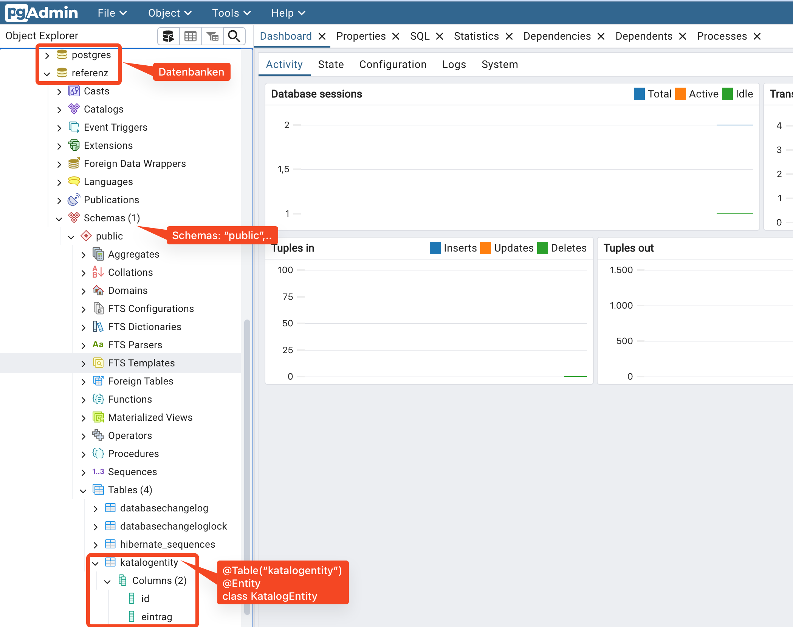
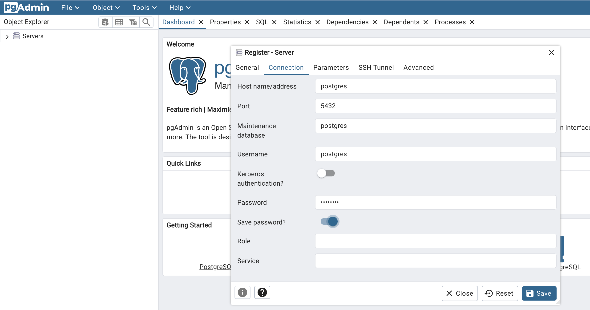

# liquibase

## Quarkus Projekt

Dieses Projekt benutzt diese extensions:

````bash
quarkus extension list
# 2024-09-02 09:02:36,042 WARN  [io.qua.boo.res.mav.wor.WorkspaceLoader] (ForkJoinPool.commonPool-worker-3) Module(s) under /workspaces/architekturmuster-mit-quarkus/getting-started will be handled as thirdparty dependencies because /workspaces/architekturmuster-mit-quarkus/getting-started/pom.xml does not exist
# Looking for the newly published extensions in registry.quarkus.io
# Current Quarkus extensions installed:
#
# ✬ ArtifactId                                         Extension Name
# ✬ quarkus-hibernate-orm-panache                      Hibernate ORM with Panache
# ✬ quarkus-jdbc-h2                                    JDBC Driver - H2
# ✬ quarkus-jdbc-postgresql                            JDBC Driver - PostgreSQL
# ✬ quarkus-liquibase                                  Liquibase
# ✬ quarkus-resteasy-reactive-jackson                  RESTEasy Reactive Jackson
#
# To get more information, append `--full` to your command line.
````

- h2 für schnelle in-memory datenbank Tests mit JPA
- postgres für eine containerisierte Datenbank im dev Modus

### Starten der Container-Datenbank postgresql

````bash
# starten
docker compose up -d postgres
# stoppen
docker compose down

````
## Quarkus Konfiguration per YAML

Wird hier benutzt.

yaml Dateien können nicht mit .properties Dateien gleichzeitig zur Konfiguration eingesetzt werden!

## Das maven plugin für liquibase

grundlegende Konfiguration muss unter `<build><plugins></plugins>` so angelegt werden:

````xml
<build>
    <plugins>
        <plugin>
            <groupId>org.liquibase</groupId>
            <artifactId>liquibase-maven-plugin</artifactId>
            <version>4.29.1</version>
            <configuration>
            </configuration>
        </plugin>
````

Die Konfiguration des liquibase plugin im Abschnitt `<configuration>`:

````xml
    <configuration>

        <searchPath>${project.basedir}/src/main/resources/db</searchPath>
        <changeLogFile>changeLog.xml</changeLogFile>
        <outputChangeLogFile>${project.basedir}/target/generated-changelog.xml</outputChangeLogFile>
        <url>jdbc:postgresql://${env.DB_HOST}:5432/katalog</url>
        <username>postgres</username>
        <password>password</password>
</configuration>
````

- die Umgebungsvariable DB_HOST wird in der vscode Konfiguration gesetzt und berücksichtigt, ob die postgres Datenbank unter localhost oder per docker network unter ihrem hostname `postgres` zu erreichen ist.

## Arbeiten mit liquibase zur Schemagenerierung

Idee:

1. eine vormals generierte

````bash
mvn liquibase:generateChangeLog
````

- schreibt in die Datei`generated-changelog.xml`
  - der Name ist in der pom.xml konfiguriert unter
     `<outputChangeLogFile>generated-changelog.xml</outputChangeLogFile>`

````bash
# zum löschen der Datenbank einfach Container löschen mit: down
docker compose down
# dadurch wird hier eine neue Instanz erzeugt: up
docker compose up -d postgres
# die zwei Schemata
mvn test -Dquarkus.test.profile=referenz
mvn test -Dquarkus.test.profile=prod
mvn liquibase:diff
mvn test -Dquarkus.test.profile=prod
mvn liquibase:diff
mvn liquibase:generateChangeLog
rm target/generated-changelog.xml
mvn liquibase:generateChangeLog
diff src/main/resources/db/changeLog.xml target/generated-changelog.xml
````

## psql Befehle auf Kommandozeile

Um in die Datenbank hineinzuschauen, muss gegeben sein:

1. die Datenbank läuft
2. der `psql` Befehl kann von der Kommandozeile aus gestartet werden
3. Ausgaben erscheinen auf der Kommandozeile

Starte `psql` im Container mit dem `exec` Befehl von `docker`:

````bash
docker compose exec postgres bash
# root@a011eca056c9:/#
````

Danach kann mit dem Befehl `psql` eine interaktive SQL-Befehlszeile gestartet werden. Das neue prompt erlaubt nun SQL direkt an die Datenbank zu schicken:

- Parameter `-U`: der username
- Parameter `-d`: der Datenbankname

Postgres gruppiert Tabellen in Schemata, und Schemata finden sich in Datenbanken, In einem Schema liegen dann die SQL Tabellen.

- Der user `postgres` ist der sogenannte root und deshalb umfassend berechtigt, auf alle Schemata und Datenbanken zuzugreifen,
- definiert wurde er [hier](docker-compose.yml):

    ````bash
    # docker-compose.yml
    services:
    postgres:
        environment:
        POSTGRES_USER: postgres
        POSTGRES_PASSWORD: password
        POSTGRES_DB: "katalog"
    ````

    ````bash
    # application.properties:
    quarkus.datasource.jdbc.url=jdbc:postgresql://${DB_HOST:localhost}:5432/katalog
    # der Datenbankname lautet: katalog
    ````

Mit diesen Informationen starten wir die SQL-Befehlszeile:

````bash
root@a011eca056c9:/# psql -d katalog -U postgres
# psql (14.1 (Debian 14.1-1.pgdg110+1))
# Type "help" for help.

katalog=#
````

und können nun in die Datenbankstruktur schauen:

- Listet alle Tabellen im Schema auf:

    ````bash
    SELECT tablename FROM pg_tables WHERE schemaname = 'public';
    #        tablename
    # -----------------------
    #  databasechangeloglock
    #  databasechangelog
    #  hibernate_sequences
    #  katalogentity
    # (4 rows)
    ````

- zeigt die Spalten einer Tabelle samt Datentypen:
-

    ````bash
    \d katalogentity
    #                        Table "public.katalogentity"
    #      Column     |          Type          | Collation | Nullable | Default
    # ----------------+------------------------+-----------+----------+---------
    #  id             | bigint                 |           | not null |
    #  eintrag        | character varying(255) |           |          |
    #  zweitereintrag | character varying(255) |           |          |
    # Indexes:
    #     "katalogentity_pkey" PRIMARY KEY, btree (id)
    # ````

 Weitere Befehle finden sich z.B. hier:

- <https://www.devart.com/dbforge/postgresql/studio/postgres-list-schemas.html#what-is-schema>
- ****

## Arbeiten mit GUI Admin-Wekzeug 'pgadmin'

So zeigt pgadmin die Struktur der Datenbank:



- starte den Container mit

    ````bash
    docker compose up -d pgadmin
    ````

- öffne im Browser unter <http://localhost:9008/browser/>
- Logindaten kommn von [hier](docker-compose.yml):

    ````bash
    pgadmin:
        image: dpage/pgadmin4
        environment:
        PGADMIN_DEFAULT_EMAIL: admin@admin.com
        PGADMIN_DEFAULT_PASSWORD: root
    ````

- klick auf das Icon mit dem Titel `Add New Server`:
  - General
    - Name: z.b. `local`
  - Connection (müssen übereinstimmen mit denem im [docker-compose.yml](docker-compose.yml)):
    - Host name/adress: `postgres` (wenn im Devcontainer arbeitend)
    - Username: `postgres`
    - Password: `password`
  - 

# H2 im Test

Im Projekt ist eine H2 als Test-Datenbank eingerichtet. Sie wird benutzt, wenn unit tests in der IDE oder mit `mvn test`ausgeführt werden.

- in der `application-test.properties` finden sich diese Einträge dazu.

Die Einträge gehören zum `test`-Profil, da sie in einer Datei mit dem Muster

- `application-{profil}.(properties|yaml)`

enthalten sind. Der Präfix `%test.` kann **und muss** innerhalb der so benannten Datei entfallen.

Das test-Profil wird gestartet, wenn mvn test ausgeführt wird. Quarkus erlaubt weitere Profile zu aktivieren, die von links nach rechts höher priorisiert sind ("überschreibend"):

- ````bash
    mvn test -Dquarkus.test.profile=test,validate
    ````

  - das Profile `validate` ergänzt mit seinen properties *oder* überschreibt properties aus test, die gleichen Namens sind.

Gleichzeitig ist eine postgres Datenbank mit ihrem Treiber hinterlegt für den Einsatz in den Profilen `dev` oder  `prod`

## Initialisierung im Image

 Der Postgres Container bietet die Möglichkeit, psql-Kommandos zum Start in einem bash-Skript einzuschleusen.
Im Rahmen der container-basierten Entwicklung machen wir das in der [docker-compose.yml](docker-compose.yml), wo die image-Referenz ersetzt wird durch ein [build-file](src/test/docker/postgres/Dockerfile), welches unser [init-Skript](src/test/docker/postgres/init-postgres.sh) einbaut.

## Schemaänderungen durchführen

Arbeitsweise:

1. Kodiere neue Entities oder anderen JPA Code.
2. Kodiere die Schema-Änderungen in die [changeLog.xml](src/main/resources/db/changeLog.xml)
3. Führe die Liquibase Schemaänderungen auf der Zieldatenbank aus.
4. Starte den Quarkus Service.

Nun gibt es Varianten und Hilfsmittel:

Das Rücksetzen der Datenbank ist am einfachsten mit dem Kommando
`(docker compose down;docker compose up -d postgres)`.

2.a Erzeuge das Schema mit hibernate, generiere ein changeLog.xml zu bestehendem Schema

````bash
mvn test -Dquarkus.test.profile=prod,update
mvn liquibase:generateChangeLog
cp target/generated-changelog.xml src/main/resources/db/changeLog.xml
````

validate:

- Caused by: org.hibernate.tool.schema.spi.SchemaManagementException: Schema-validation: missing column [eintra2g] in table [KatalogEntity]

### troubleshooting

- [ERROR] Error setting up or running Liquibase:
[ERROR] liquibase.exception.LiquibaseException: liquibase.exception.MigrationFailedException: Migration failed for changeset changeLog.xml::1725208825608-1::vscode (generated):
[ERROR]      Reason: liquibase.exception.DatabaseException: ERROR: relation "hibernate_sequences" already exists [Failed SQL: (0) CREATE TABLE hibernate_sequences (next_val BIGINT, sequence_name VARCHAR(255) NOT NULL, CONSTRAINT hibernate_sequences_pkey PRIMARY KEY (sequence_name))]
  - hier hilft ein mvn liquibase:changelogSync
  - Ursache kann sein, dass in der databasechangelog Tabelle die changes mit verschiedenen filenames auftauchen:

    ````
        katalog=# select * from databasechangelog;
        id        |       author       |     filename     |        dateexecuted        | orderexecuted | exectype |               md
    5sum               |                description                | comments | tag | liquibase | contexts | labels | deployment_id
    -----------------+--------------------+------------------+----------------------------+---------------+----------+-----------------
    -------------------+-------------------------------------------+----------+-----+-----------+----------+--------+---------------
    1725208825608-1 | vscode (generated) | db/changeLog.xml | 2024-09-16 17:29:31.872321 |             1 | EXECUTED | 9:b9668c95a312c4
    d7dbaaef738b0f7dfb | createTable tableName=hibernate_sequences |          |     | 4.25.1    |          |        | 6507771831
    1725208825608-2 | vscode (generated) | db/changeLog.xml | 2024-09-16 17:29:31.891662 |             2 | EXECUTED | 9:3284275c30003a
    692f29975518a0c338 | createTable tableName=katalogentity       |          |     | 4.25.1    |          |        | 6507771831
    zwei            | avogt              | db/changeLog.xml | 2024-09-16 17:29:31.905749 |             3 | EXECUTED | 9:9e5e9ed52ae04a
    a84aa3ed4c1e213748 | addColumn tableName=katalogentity         |          |     | 4.25.1    |          |        | 6507771831
    1725208825608-1 | vscode (generated) | changeLog.xml    | 2024-09-16 17:36:26.281936 |             4 | EXECUTED | 9:b9668c95a312c4
    d7dbaaef738b0f7dfb | createTable tableName=hibernate_sequences |          |     | 4.25.1    |          |        | 6508186297
    1725208825608-2 | vscode (generated) | changeLog.xml    | 2024-09-16 17:36:26.309986 |             5 | EXECUTED | 9:3284275c30003a
    692f29975518a0c338 | createTable tableName=katalogentity       |          |     | 4.25.1    |          |        | 6508186297
    zwei            | avogt              | changeLog.xml    | 2024-09-16 17:36:26.313523 |             6 | EXECUTED | 9:9e5e9ed52ae04a
    a84aa3ed4c1e213748 | addColumn tableName=katalogentity         |          |     | 4.25.1    |          |        | 6508186297
    (6 rows)
    ````

- java.lang.IllegalStateException: The named datasource 'default-reactive' has not been properly configured. See <https://quarkus.io/guides/datasource#multiple-datasources> for information on how to do that.
- `[error]: Build step io.quarkus.hibernate.orm.deployment.HibernateOrmProcessor#configurationDescriptorBuilding threw an exception: io.quarkus.runtime.configuration.ConfigurationException: Datasource must be defined for persistence unit 'h2test'. Refer to https://quarkus.io/guides/datasource for guidance.`
  - `quarkus.hibernate-orm."pg".datasource=pg`
  - Lösung: sobald mehr als eine persistenceunit benutzt wird, muss diese konfigurativ eindeutig mit einer definierten datasource verbunden werden!
- `[error]: Build step io.quarkus.hibernate.orm.deployment.HibernateOrmProcessor#configurationDescriptorBuilding threw an exception: io.quarkus.runtime.configuration.ConfigurationException: Packages must be configured for persistence unit 'guitars'.`
  - ....
- `[ERROR] liquibase.exception.LiquibaseException: liquibase.exception.CommandValidationException: Output ChangeLogFile '/workspaces/architekturmuster-mit-quarkus/liquibase/target/generated-changelog.xml' already exists!`
  - einfach die Datei vorher löschen, denn das Kommando `mvn liquibase:generateChangeLog` vermeidet das stille Überschreiben der in er pom.xml deklarierten Ausgabedatei.

## Links

- Offizielles Docker image für postgres:
  - <https://hub.docker.com/_/postgres/>
  - darin beschrieben, wie man mit einem [init script](./src/test/docker/postgres/init-postgres.sh) eine zweite Datenbank erzeugt.

- liquibase diffs
  - <https://www.liquibase.com/blog/liquibase-diffs#what-types-of-diff-based-commands-are-available-in-liquibase>
- postgres
  - <https://postgresql-tutorial.com/postgresql-how-to-list-all-columns-of-a-table/>
